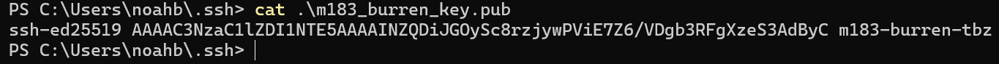
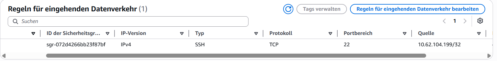
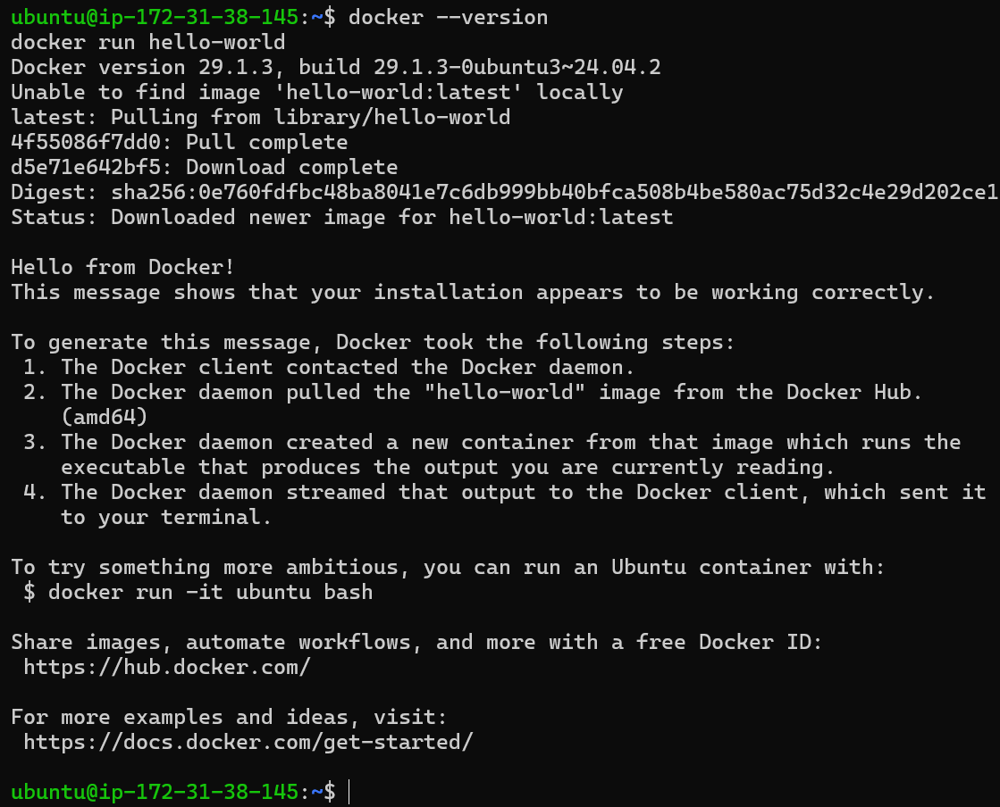

# EC2-Setup – Grundlage für alle Kompetenznachweise

Name: Noah Burren

## Übersicht

In diesem Kompetenznachweis habe ich eine EC2-Instanz im AWS Learner Lab erstellt und eingerichtet. Anschliessend habe ich mich per SSH verbunden und überprüft, ob Docker korrekt installiert wurde.

Bearbeitete Aufgaben:

- B – SSH-Schlüsselpaar erstellen
- C – Sicherheitsgruppe erstellen
- D – EC2 mit Cloud-Init starten
- E – SSH-Verbindung und Docker testen

---

# B – SSH-Schlüsselpaar erstellen

Ich habe lokal ein SSH-Schlüsselpaar erstellt und den Public Key ausgegeben.

## Public Key



---

# C – Sicherheitsgruppe

Ich habe eine Sicherheitsgruppe **m183-sg** erstellt und den SSH-Port nur für meine eigene IP-Adresse freigegeben.

## Inbound Rules



---

# D – EC2 mit Cloud-Init starten

Für die Instanz habe ich folgendes Cloud-Init-Script verwendet.

```yaml
#cloud-config

users:
  - name: ubuntu
    groups: docker
    sudo: ALL=(ALL) NOPASSWD:ALL
    shell: /bin/bash
    ssh_authorized_keys:
      - ssh-ed25519 AAAAC3NzaC1lZDI1NTE5AAAAINZQDiJGOySc8rzjywPViE7Z6/VDgb3RFgXzeS3AdByC m183-burren-tbz

packages:
  - docker.io

runcmd:
  - systemctl start docker
  - systemctl enable docker
```

Das Script richtet den Benutzer **ubuntu** ein, fügt meinen Public Key hinzu und installiert Docker automatisch beim ersten Start der Instanz.

---

# E – SSH-Verbindung und Docker

Nach einigen Minuten konnte ich mich erfolgreich per SSH mit der EC2-Instanz verbinden.

Anschliessend habe ich geprüft, ob Docker korrekt installiert wurde.

Verwendete Befehle:

```bash
docker --version
docker run hello-world
```

## Ergebnis



Die Installation war erfolgreich. Der `hello-world`-Container wurde gestartet und die Meldung **"Hello from Docker!"** wurde angezeigt.

---

# Leitfragen

### Was ist der Unterschied zwischen Public Key und Private Key?

Der Public Key darf weitergegeben werden und wird auf dem Server gespeichert. Der Private Key bleibt nur auf meinem Computer und dient zur Anmeldung.

### Warum darf der Private Key nie weitergegeben werden?

Mit dem Private Key könnte sich jemand als mich auf dem Server anmelden.

### Was ist ein Cloud-Init-Script?

Ein Cloud-Init-Script wird beim ersten Start einer EC2-Instanz automatisch ausgeführt und richtet den Server ein.

### Warum sollte man SSH nicht für `0.0.0.0/0` freigeben?

Weil dann jeder aus dem Internet versuchen kann, sich mit der Instanz zu verbinden.

### Unterschied zwischen Stop und Terminate

- **Stop:** Die Instanz wird ausgeschaltet und kann später wieder gestartet werden.
- **Terminate:** Die Instanz wird endgültig gelöscht.

---

# Fazit

Ich konnte erfolgreich eine EC2-Instanz erstellen, meinen eigenen SSH-Schlüssel verwenden und Docker automatisch über Cloud-Init installieren. Danach konnte ich mich per SSH verbinden und die Docker-Installation mit dem `hello-world`-Container erfolgreich testen.