# KN-01 – OWASP Top 10 mit Gruyere

Name: Noah Burren

## Übersicht

In diesem KN habe ich verschiedene OWASP-Schwachstellen mit der Google Gruyere Webapplikation getestet.

Bearbeitete Aufgaben:

- A – Gruyere starten und Accounts erstellen
- B1 – Stored XSS
- B2 – Cookies
- B3 – Session Hijacking
- C – Reflected XSS
- D – Client-State Manipulation

---

# A – Gruyere starten

Ich habe eine eigene Gruyere-Instanz gestartet und zwei Benutzer erstellt:

- angreifer-noah
- verteidiger-noah

## Angreifer

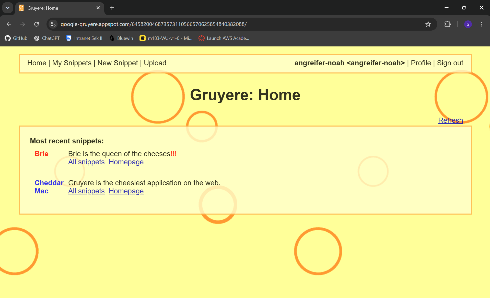

## Verteidiger

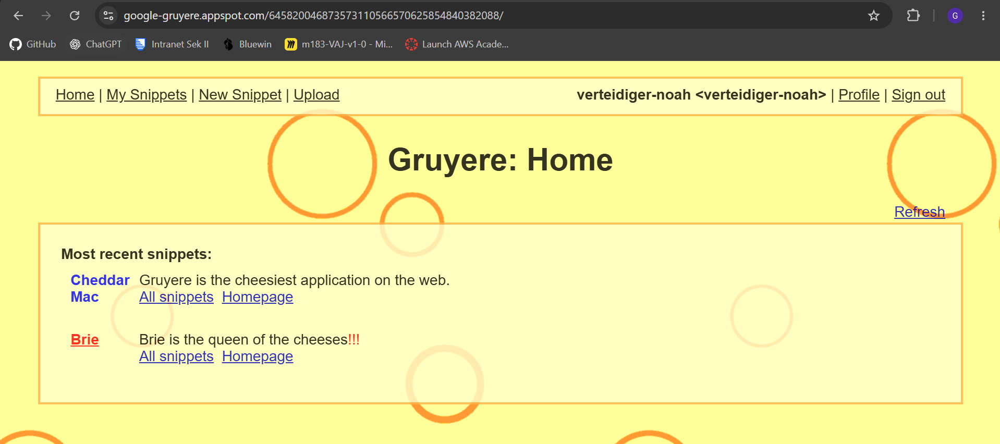

---

# B1 – Stored XSS

Payload:

```html

```

Beim Neuladen wurde die Menüleiste rot. Da der Payload gespeichert wird, passiert dies auch bei anderen Benutzern.

## Angreifer

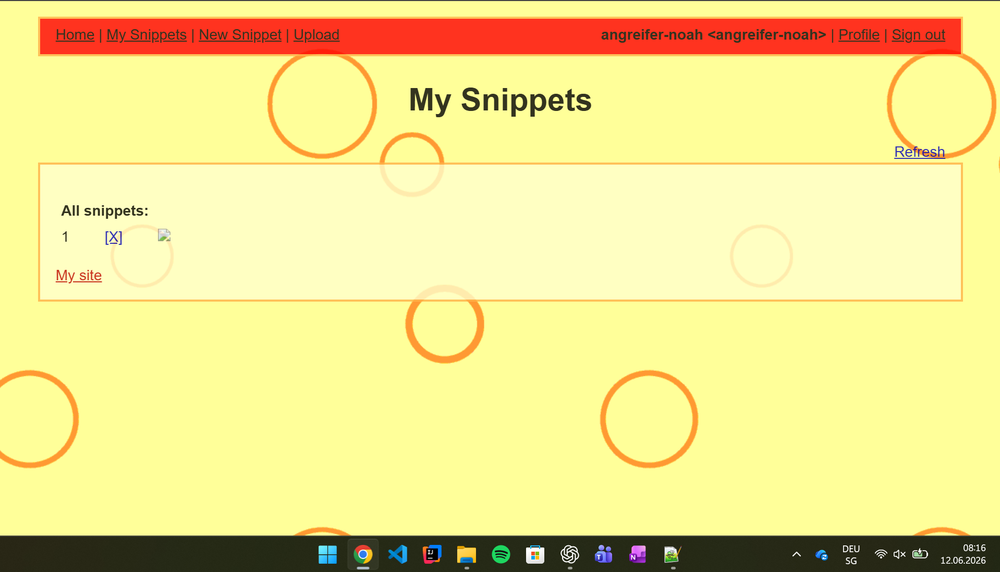

## Verteidiger

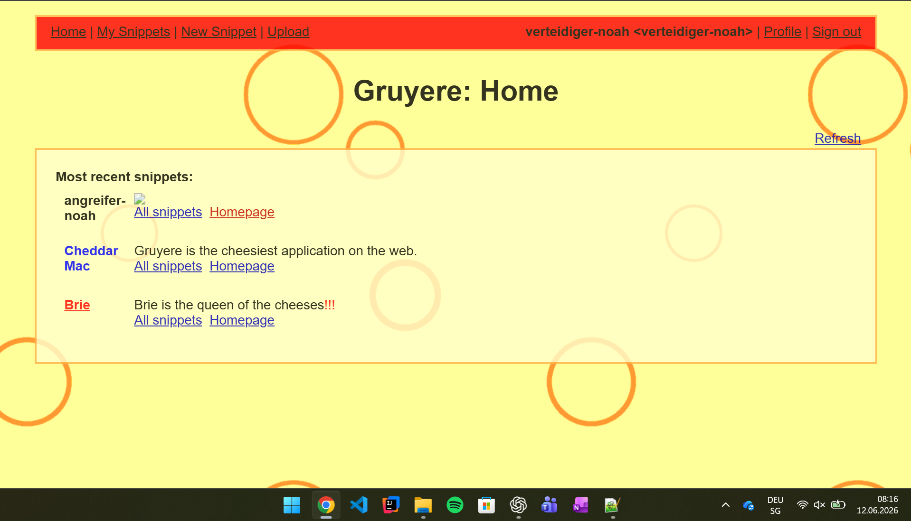

### Antworten

1. Der Payload verwendet kein `<script>`, sondern das `onerror`-Event eines Bildes.
2. Der Schadcode wird bei jedem Besucher ausgeführt.
3. OWASP Top 10: **A05:2025 – Injection**
4. Schutz durch Output Encoding. :contentReference[oaicite:0]{index=0}

---

# B2 – Cookies

Ich habe den Session-Cookie in den DevTools angeschaut und danach mit XSS sichtbar gemacht.

## Cookie in DevTools

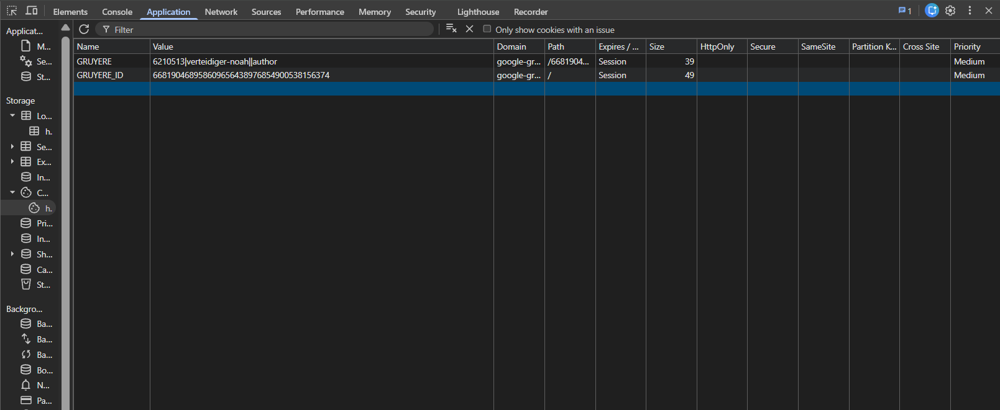

## Sichtbares Cookie

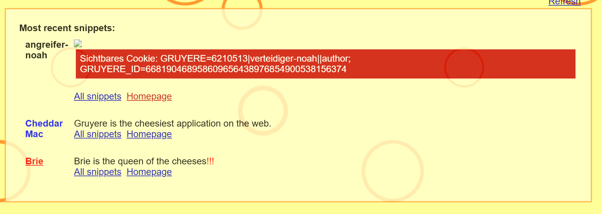

### Antworten

- Mit dem Session-Cookie kann ein Angreifer die Sitzung übernehmen.
- HttpOnly verhindert das Auslesen per JavaScript.
- localStorage ist unsicher, weil JavaScript darauf zugreifen kann. :contentReference[oaicite:1]{index=1}

---

# B3 – Session Hijacking

Für diese Aufgabe habe ich auf meiner EC2-Instanz einen Python-Webserver gestartet und einen HTTPS-Tunnel mit Serveo eingerichtet.

## Python HTTP Server

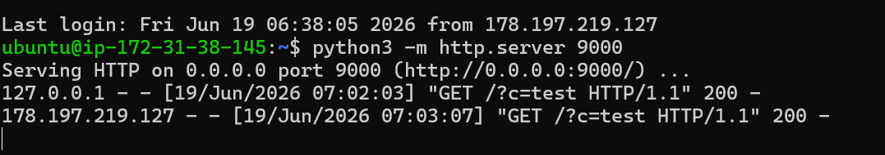

## Serveo Tunnel

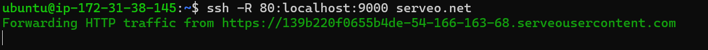

Leider konnte der Angriff am Schluss nicht vollständig durchgeführt werden, weil der Serveo-Tunnel keine Verbindung mehr aufgebaut hat (`ERR_CONNECTION_RESET`).

Die Konfiguration und der Payload waren korrekt, das Problem lag am Tunnel.

Weitere Details befinden sich in **B3.md**. :contentReference[oaicite:2]{index=2}

---

# C – Reflected XSS

Zuerst habe ich einen Reflection-Punkt gesucht.

## Test mit HELLOTEST

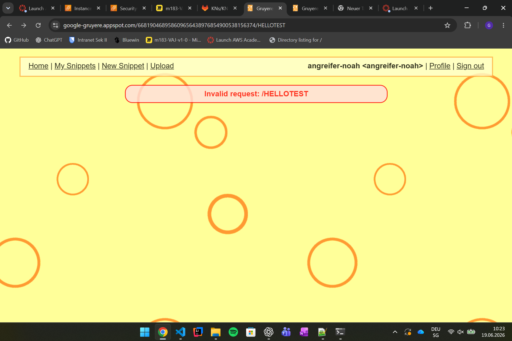

Danach habe ich einen XSS-Payload über den URL-Parameter getestet.

## Payload

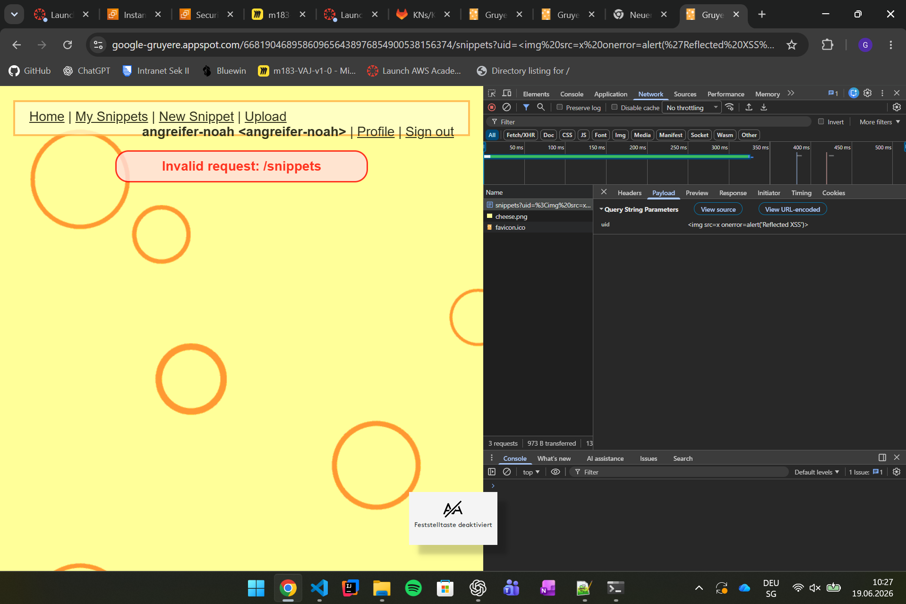

### Antworten

- Stored XSS wird gespeichert und betrifft alle Besucher.
- Reflected XSS wird nur über einen manipulierten Link ausgeführt.
- Opfer werden meistens über Social Engineering auf den Link gelockt.
- Schutz: **OWASP Proactive Control C4 – Encode and Escape Data**

---

# D – Client-State Manipulation

Ich habe den Cookie analysiert und dessen Inhalt untersucht.

## Cookie

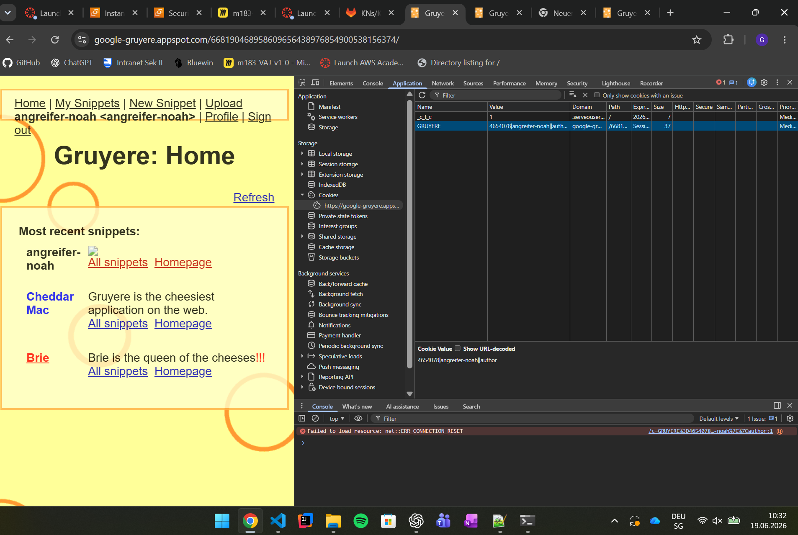

### Antworten

- Berechtigungen dürfen nicht im Client gespeichert werden.
- Rechte müssen immer auf dem Server überprüft werden.
- Passende OWASP Top 10 Kategorie: **A01:2025 – Broken Access Control**

---

# Fazit

In diesem KN konnte ich verschiedene XSS-Angriffe praktisch ausprobieren und sehen, wie einfach Cookies gestohlen oder manipuliert werden können.

Besonders interessant fand ich den Unterschied zwischen Stored und Reflected XSS sowie den Einsatz von Session-Cookies. Der einzige Teil, der nicht vollständig funktionierte, war der Cookie-Diebstahl über den Serveo-Tunnel, da der Tunnel keine stabile Verbindung aufgebaut hat.