# KN-02 – WebGoat Web Security (M183)

## Übersicht

In diesem Kompetenznachweis wurden verschiedene typische Web-Schwachstellen mit **WebGoat** praktisch untersucht und ausgenutzt. Bearbeitet wurden SQL Injection, Cross-Site Scripting (XSS) sowie Cross-Site Request Forgery (CSRF). Dabei wurden sowohl die Funktionsweise der Angriffe als auch geeignete Schutzmassnahmen analysiert und dokumentiert.

---

# A) WebGoat starten

## WebGoat Login

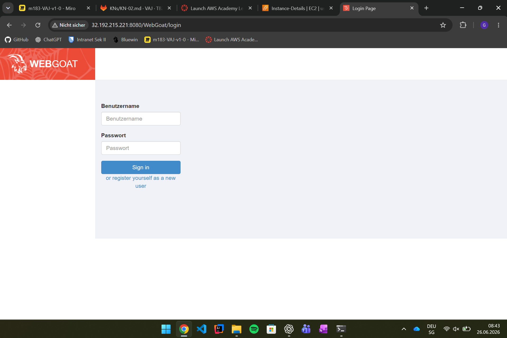

Die WebGoat-Anwendung wurde erfolgreich auf einer AWS EC2-Instanz mittels Docker gestartet und war über Port **8080** erreichbar.

---

## Docker-Container starten

WebGoat wurde mit folgendem Befehl gestartet:

```bash
docker run -d --name webgoat -p 8080:8080 webgoat/webgoat
```

Zur Kontrolle wurde überprüft, ob der Container läuft:

```bash
docker ps
```

---

## Erreichbarkeit

Die Anwendung konnte anschliessend im Browser über folgende URL geöffnet werden:

```text
http://32.192.215.221:8080/WebGoat
```

Vor dem Start wurde in der Security Group **m183-sg** der TCP-Port **8080** ausschliesslich für die eigene öffentliche IP-Adresse freigegeben.

---

## Benutzerkonto

Über **Register new user** wurde ein neues Benutzerkonto erstellt. Danach konnte die Anmeldung erfolgreich durchgeführt werden und sämtliche Übungen standen zur Verfügung.

---

## Verwendete Umgebung

| Komponente | Wert |
|------------|------|
| Cloud | AWS EC2 |
| Betriebssystem | Ubuntu |
| Container | Docker |
| Anwendung | WebGoat |
| Port | 8080 |
| Zugriff | HTTP |

---

## Ergebnis

Die WebGoat-Instanz konnte erfolgreich gestartet und verwendet werden. Alle weiteren Übungen des Kompetenznachweises wurden auf dieser Instanz durchgeführt.

---

# Fazit A

Die benötigte Testumgebung konnte erfolgreich eingerichtet werden. Durch das Bereitstellen von WebGoat auf einer eigenen EC2-Instanz standen realistische Bedingungen zur Verfügung, um verschiedene Web-Sicherheitslücken praktisch nachzustellen und zu analysieren.

# B) SQL Injection

## Übersicht

In diesem Teil des Kompetenznachweises wurden verschiedene SQL-Injection-Angriffe mit WebGoat durchgeführt. Ziel war es, die Authentifizierung einer Webanwendung zu umgehen sowie mittels Query Chaining Daten in der Datenbank zu verändern. Anschliessend wurden geeignete Schutzmassnahmen analysiert.

---

# B1) Login Bypass

## Erfolgreicher Login mittels SQL Injection

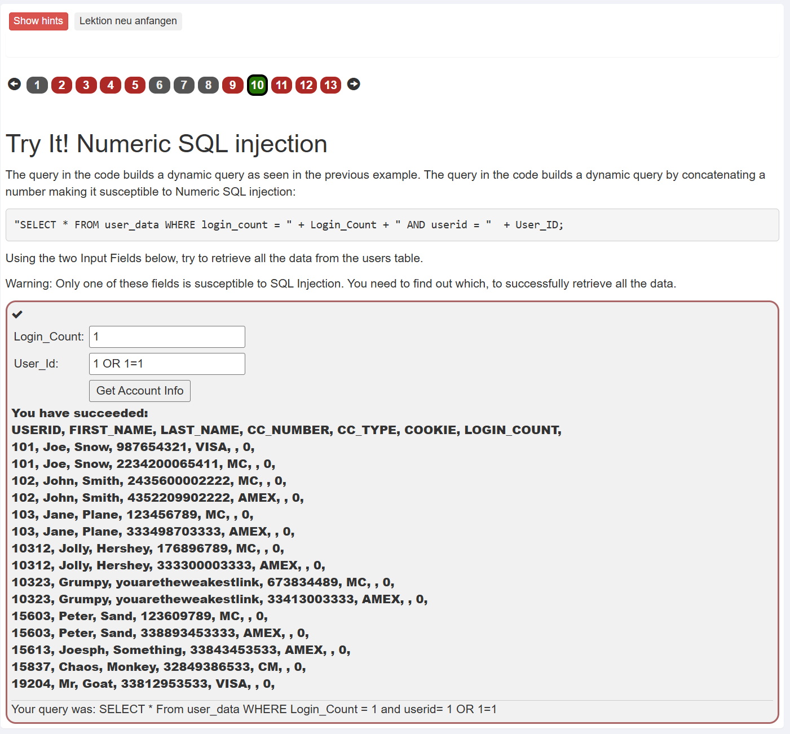

Durch das Einschleusen eines SQL-Payloads konnte die Authentifizierung erfolgreich umgangen werden.

---

## Verwendeter Payload

```sql
' OR '1'='1
```

Alternativ funktionierte in WebGoat ebenfalls:

```sql
' OR 1=1 --
```

---

## Erklärung

Die Anwendung fügte die Benutzereingabe ungefiltert direkt in die SQL-Abfrage ein.

Die ursprüngliche SQL-Abfrage lautete:

```sql
SELECT * FROM users
WHERE name = 'Smith'
AND password = 'passwort';
```

Nach der SQL Injection entstand folgende Abfrage:

```sql
SELECT * FROM users
WHERE name = 'Smith'
AND password = '' OR '1'='1';
```

Da der Ausdruck

```sql
'1'='1'
```

immer wahr ist, liefert die Datenbank alle passenden Datensätze zurück.

Die Anwendung interpretiert dies als erfolgreichen Login, obwohl kein gültiges Passwort bekannt ist.

---

# B2) Query Chaining – Integrität kompromittieren

## Erfolgreiche Änderung eines Datensatzes

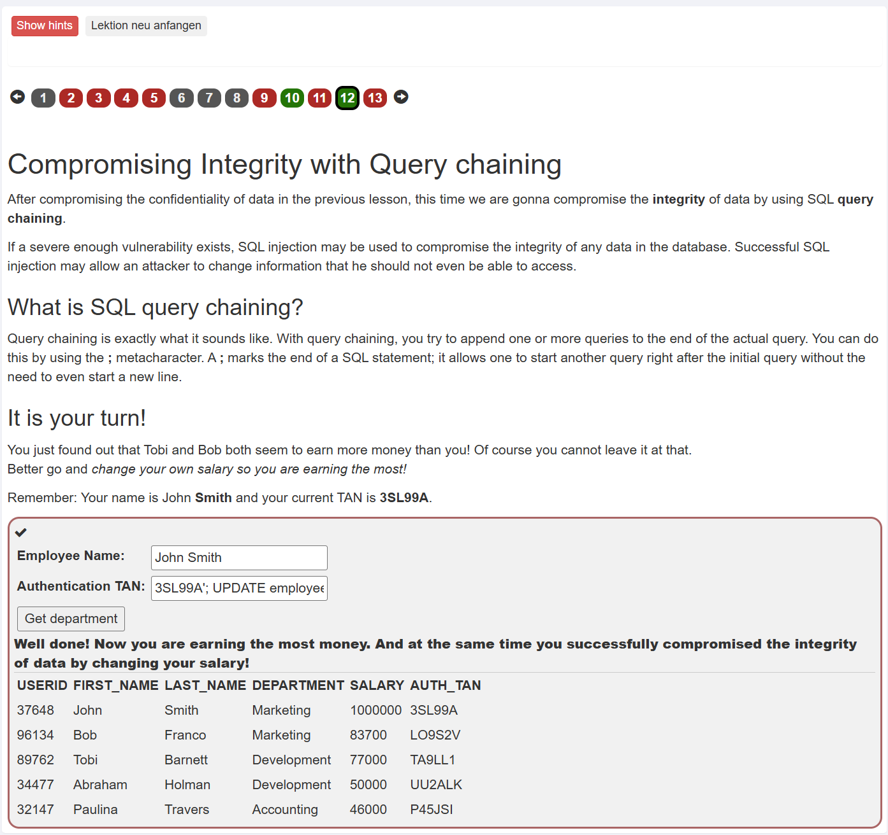

Im zweiten Teil wurde Query Chaining verwendet, um zusätzlich zur ursprünglichen SQL-Abfrage einen weiteren SQL-Befehl auszuführen.

---

## Verwendeter Payload

```sql
3SL99A';
UPDATE employees
SET salary=1000000
WHERE first_name='John';
--
```

---

## Ergebnis

Durch den eingeschleusten `UPDATE`-Befehl wurde das Gehalt des Mitarbeiters **John** erfolgreich geändert.

Dies zeigt, dass SQL Injection nicht nur zum Auslesen von Daten verwendet werden kann, sondern ebenfalls die Integrität einer Datenbank gefährdet.

---

# Schriftliche Antworten

## Wie sieht das SQL-Statement vor und nach dem Payload aus?

**Vor der SQL Injection:**

```sql
SELECT * FROM users
WHERE name = 'Smith'
AND password = 'passwort';
```

**Nach der SQL Injection:**

```sql
SELECT * FROM users
WHERE name = 'Smith'
AND password = '' OR '1'='1';
```

### Erklärung

Der Ausdruck `'1'='1'` ist immer wahr.

Dadurch wird die gesamte WHERE-Bedingung wahr und die Datenbank liefert alle passenden Datensätze zurück. Die Anwendung interpretiert dies als erfolgreichen Login, obwohl das richtige Passwort nicht bekannt ist. Dadurch wird die Authentifizierung umgangen.

---

## Wie funktionieren Prepared Statements?

Prepared Statements (parameterisierte Abfragen) trennen den SQL-Befehl von den Benutzereingaben.

Beispiel:

```sql
SELECT * FROM users
WHERE name = ?
AND password = ?;
```

Die Datenbank kompiliert zuerst die SQL-Abfrage. Anschliessend werden die Benutzereingaben lediglich als Werte an die Platzhalter (`?`) übergeben.

Dadurch werden Sonderzeichen wie `'`, `;` oder `--` nicht mehr als SQL-Code interpretiert, sondern als normaler Text behandelt. SQL Injection ist dadurch nicht mehr möglich.

---

## Welche OWASP Top 10 Kategorie (2025) beschreibt SQL Injection?

**A03:2025 – Injection**

Diese Kategorie umfasst Schwachstellen, bei denen Benutzereingaben als Befehle oder Abfragen interpretiert werden. SQL Injection ist eines der bekanntesten Beispiele dafür.

---

## Zwei weitere Injection-Varianten

### OS Command Injection

Hier werden Betriebssystembefehle (z. B. `ls`, `cat` oder `rm`) eingeschleust. Ein Angreifer kann dadurch beliebige Befehle auf dem Server ausführen, Dateien lesen oder löschen oder sogar die vollständige Kontrolle über das System erlangen.

### LDAP Injection

Hier werden LDAP-Abfragen manipuliert. Ein Angreifer kann dadurch Authentifizierungen umgehen oder auf vertrauliche Informationen eines Verzeichnisdienstes (z. B. Active Directory) zugreifen.

---

# Fazit B

SQL Injection gehört zu den gefährlichsten Web-Schwachstellen. Bereits eine ungefilterte Benutzereingabe genügt, um Daten auszulesen, Logins zu umgehen oder Datenbankeinträge zu verändern. Durch den Einsatz von Prepared Statements sowie einer konsequenten Eingabevalidierung kann diese Schwachstelle zuverlässig verhindert werden.

# C) Cross-Site Scripting (XSS)

## Übersicht

In diesem Teil des Kompetenznachweises wurden verschiedene Arten von Cross-Site Scripting (XSS) mit WebGoat untersucht. Bearbeitet wurden **Reflected XSS**, **DOM-based XSS** sowie **Stored XSS**. Ziel war es, die unterschiedlichen Angriffstechniken kennenzulernen und geeignete Schutzmassnahmen zu verstehen.

---

# C1a) Reflected XSS

## Erfolgreicher Reflected-XSS-Angriff

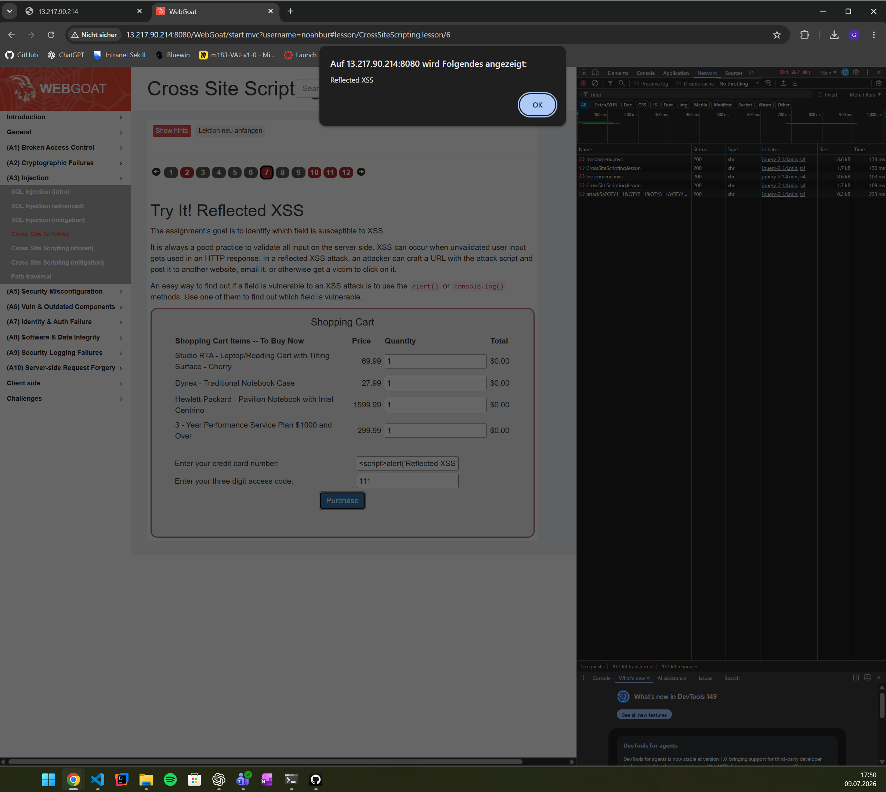

Durch die Eingabe eines JavaScript-Payloads wurde dieser ungefiltert in die HTML-Antwort übernommen und im Browser ausgeführt.

---

## Verwendeter Payload

```html
<script>alert('Reflected XSS')</script>
```

Beim Absenden des Formulars erschien unmittelbar ein JavaScript-Alert. Dadurch wurde bestätigt, dass die Benutzereingabe ohne ausreichende Filterung in die Antwort eingebettet wurde.

---

## Erklärung

Bei Reflected XSS wird der schädliche JavaScript-Code nicht dauerhaft gespeichert. Stattdessen wird die Eingabe unmittelbar in der Serverantwort zurückgegeben und anschliessend vom Browser ausgeführt.

Nur Benutzer, welche den manipulierten Link oder die manipulierte Anfrage öffnen, sind von diesem Angriff betroffen.

---

# C1b) DOM-based XSS

## Analyse der verwundbaren Codezeilen

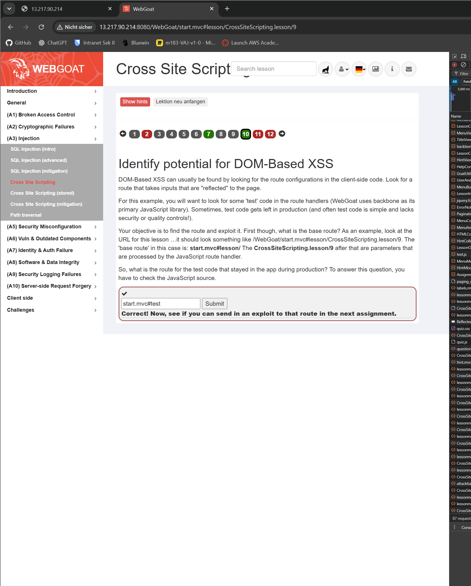

Im zweiten Teil mussten die JavaScript-Codezeilen identifiziert werden, welche für DOM-based XSS anfällig sind.

---

## Ergebnis

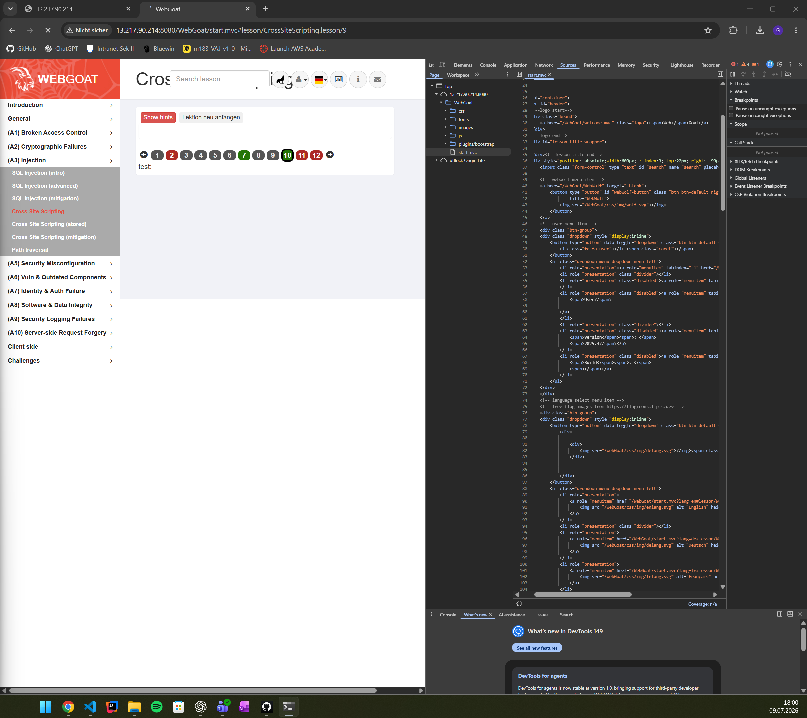

Als verwundbar wurden diejenigen Codezeilen erkannt, welche Benutzereingaben direkt mittels JavaScript in den DOM schreiben.

Typische Beispiele sind:

```javascript
document.getElementById("output").innerHTML = location.hash;
```

oder

```javascript
document.write(location.search);
```

---

## Erklärung

Bei DOM-based XSS verarbeitet ausschliesslich der Browser den Schadcode.

Der Server erhält den Payload nie und kann ihn deshalb auch nicht erkennen oder filtern. Dadurch unterscheiden sich DOM-basierte Angriffe wesentlich von Reflected XSS.

---

# C2) Stored XSS

## Erfolgreicher Stored-XSS-Angriff

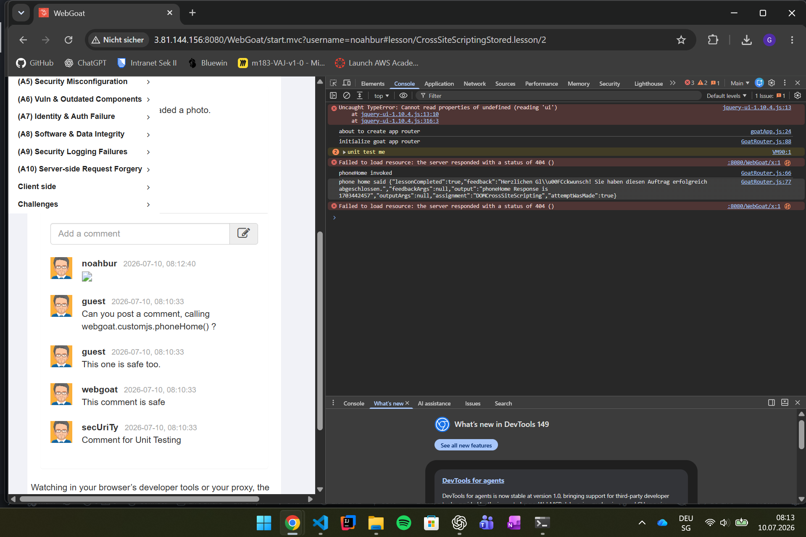

Im Kommentarfeld wurde ein schädlicher Payload gespeichert.

Beim erneuten Laden der Seite wurde dieser automatisch ausgeführt.

---

## Verwendeter Payload

```html

```

Nach dem Speichern des Kommentars führte der Browser den JavaScript-Code automatisch aus und WebGoat bestätigte den erfolgreichen Angriff.

---

## Erklärung

Stored XSS speichert den Schadcode dauerhaft auf dem Server, beispielsweise in einer Datenbank.

Jeder Benutzer, der die betroffene Seite öffnet, führt den Schadcode automatisch aus. Dadurch besitzt Stored XSS eine wesentlich grössere Reichweite als Reflected XSS.

---

# Schriftliche Antworten

## Was ist der zentrale Unterschied zwischen Reflected XSS und Stored XSS hinsichtlich Persistenz und Reichweite?

**Reflected XSS** wird nicht dauerhaft gespeichert. Der schädliche Code wird nur als Teil einer Anfrage (z. B. über einen manipulierten Link) zurückgegeben und betrifft nur Benutzer, die diesen Link öffnen.

**Stored XSS** wird dauerhaft auf dem Server gespeichert (z. B. in Kommentaren oder Datenbanken). Jeder Benutzer, der die betroffene Seite besucht, führt den Schadcode aus. Dadurch ist die Reichweite deutlich grösser.

---

## Was unterscheidet DOM-based XSS von Reflected XSS?

Bei **Reflected XSS** wird der Schadcode vom Server in der HTTP-Antwort zurückgegeben.

Bei **DOM-based XSS** verarbeitet der Browser den Schadcode vollständig clientseitig über JavaScript und schreibt ihn direkt in den DOM. Der Server sieht den Schadcode nie und kann ihn deshalb nicht filtern. Dadurch ist DOM-based XSS für serverseitige Schutzmechanismen schwieriger zu erkennen.

---

## Was bedeutet Output Encoding und warum schützt es gegen XSS?

Output Encoding bedeutet, dass Sonderzeichen vor der Ausgabe in HTML in HTML-Entitäten umgewandelt werden.

Dadurch interpretiert der Browser die Eingabe als normalen Text statt als ausführbaren JavaScript-Code.

Beispiel:

Vor dem Encoding:

```html
<script>
```

Nach dem Encoding:

```html
&lt;script&gt;
```

Dadurch wird `<script>` lediglich angezeigt und nicht ausgeführt.

---

## Was ist die Content-Security-Policy (CSP)?

Content-Security-Policy (CSP) ist ein HTTP-Header, der festlegt, aus welchen Quellen JavaScript, CSS oder Bilder geladen werden dürfen.

Dadurch können beispielsweise Inline-Skripte oder Skripte von unbekannten Webseiten blockiert werden. Selbst wenn ein Angreifer JavaScript einschleusen kann, verhindert CSP häufig dessen Ausführung.

---

## Welche OWASP Top 10 Kategorie (2021) beschreibt XSS?

**A03:2021 – Injection**

Seit den OWASP Top 10 von 2021 wird Cross-Site Scripting nicht mehr als eigene Kategorie geführt, sondern gehört zur Kategorie **Injection**.

---

# Fazit C

Cross-Site Scripting zählt zu den häufigsten Schwachstellen moderner Webanwendungen. Während Reflected XSS nur einzelne Benutzer betrifft, kann Stored XSS alle Besucher einer Webseite gefährden. DOM-based XSS zeigt zudem, dass Angriffe vollständig im Browser stattfinden können und dadurch serverseitige Filter umgehen. Schutz bieten insbesondere Output Encoding, Content-Security-Policy sowie eine konsequente Validierung und Filterung sämtlicher Benutzereingaben.

# D) Cross-Site Request Forgery (CSRF)

## Übersicht

In diesem Teil des Kompetenznachweises wurde ein **Cross-Site Request Forgery (CSRF)**-Angriff mit WebGoat durchgeführt. Ziel war es, eine Aktion in WebGoat über eine externe HTML-Datei auszulösen, ohne die WebGoat-Oberfläche direkt zu verwenden. Anschliessend wurden verschiedene Schutzmechanismen gegen CSRF analysiert.

---

# D1) Analyse der Anfrage

## Netzwerkanalyse

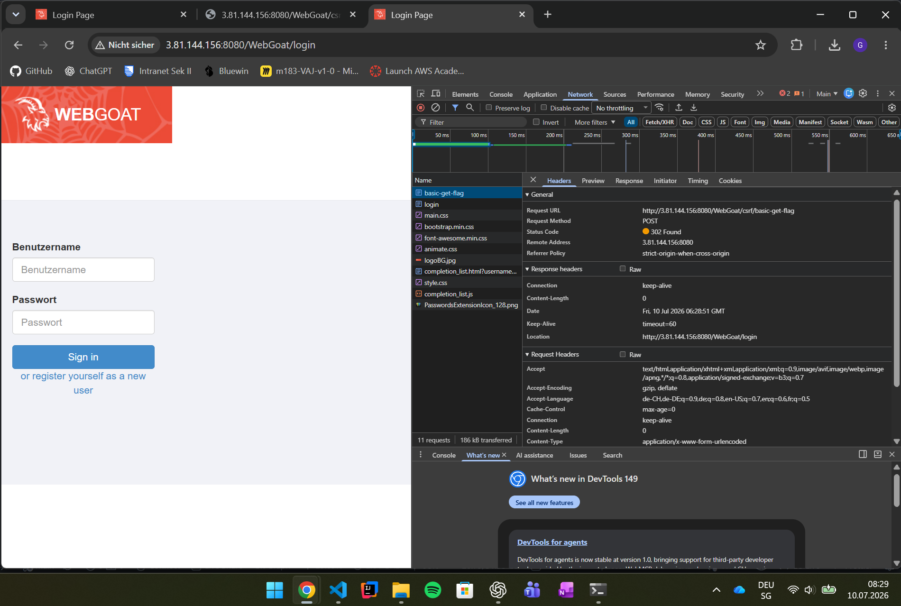

Zunächst wurde die Anfrage mit den Entwicklertools (F12 → Network) analysiert.

Dabei konnten folgende Informationen ermittelt werden:

| Eigenschaft | Wert |
|-------------|------|
| URL | `http://3.81.144.156:8080/WebGoat/csrf/basic-get-flag` |
| HTTP-Methode | POST |
| Parameter | keine |

Diese Informationen wurden benötigt, um die externe HTML-Datei für den Angriff zu erstellen.

---

# D2) Erstellung der CSRF-Seite

## Inhalt der Datei `csrf-attack.html`

Die folgende HTML-Datei wurde lokal auf dem Rechner gespeichert.

```html
<!DOCTYPE html>
<html>
<head>
    <title>Gewinnspiel</title>
</head>

<body>

<h1>Glückwunsch! Sie haben gewonnen!</h1>

<p>Klicken Sie auf den Button, um Ihren Preis einzulösen:</p>

<form
    id="csrfForm"
    action="http://3.81.144.156:8080/WebGoat/csrf/basic-get-flag"
    method="POST">

    <input
        type="submit"
        value="HIER PREIS ABHOLEN"
        style="
        padding:10px 20px;
        font-size:16px;
        background:green;
        color:white;
        border:none;
        cursor:pointer;">

</form>

</body>
</html>
```

Die HTML-Datei wurde ausserhalb von WebGoat geöffnet, während gleichzeitig eine aktive WebGoat-Sitzung im Browser bestand.

---

# D3) Erfolgreicher Angriff

## Erfolgreiche Ausführung

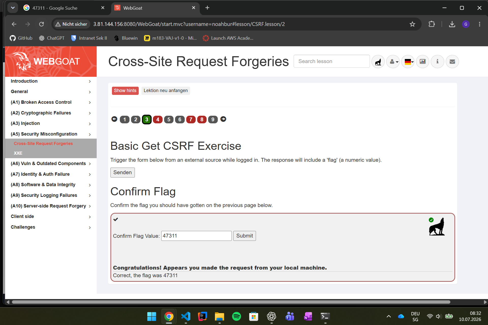

Nach dem Öffnen der HTML-Datei wurde die Anfrage automatisch an WebGoat gesendet.

Da der Browser den Session-Cookie automatisch mitsendete, erkannte WebGoat die Anfrage als authentifiziert und lieferte den Flag zurück.

Die Aufgabe konnte dadurch erfolgreich abgeschlossen werden.

---

# Schriftliche Antworten

## Warum schickt der Browser den Session-Cookie mit, obwohl die Anfrage von einer lokalen HTML-Datei kommt?

Der Browser sendet den **Session-Cookie automatisch** an die Ziel-Domain, für die der Cookie gespeichert wurde. Entscheidend ist nicht, von welcher Webseite die Anfrage stammt, sondern an welche Domain sie gesendet wird. Ist der Benutzer noch bei WebGoat eingeloggt, wird der Session-Cookie automatisch mitgeschickt und der Server betrachtet die Anfrage als authentifiziert.

---

## Was ist ein CSRF-Token und warum kann eine Angreifer-Seite ihn nicht einfach lesen?

Ein **CSRF-Token** ist ein zufällig erzeugter, geheimer Wert, der in jedes Formular oder jede sicherheitsrelevante Anfrage eingebettet wird. Der Server überprüft bei jeder Anfrage, ob der Token gültig ist.

Eine Angreifer-Seite kann diesen Token nicht auslesen, da die **Same-Origin-Policy** verhindert, dass JavaScript Inhalte einer fremden Webseite oder deren Formulare lesen kann. Dadurch kennt der Angreifer den benötigten Token nicht und kann keine gültige Anfrage erzeugen.

---

## Was bewirkt das `SameSite=Strict`-Flag bei einem Cookie?

Das Cookie-Attribut **`SameSite=Strict`** sorgt dafür, dass Cookies nur bei Anfragen derselben Website mitgesendet werden.

Wird eine Anfrage von einer fremden Webseite oder einer lokalen HTML-Datei ausgelöst, wird der Session-Cookie nicht übertragen. Dadurch kann der Server den Benutzer nicht authentifizieren und der CSRF-Angriff schlägt fehl.

---

## Welche OWASP Top 10 Kategorie (2025) beschreibt CSRF?

**A01:2025 – Broken Access Control**

CSRF gehört zur Kategorie **Broken Access Control**, da ein Angreifer Aktionen im Namen eines angemeldeten Benutzers ausführen kann, ohne dessen Zustimmung.

---

# Schutzmassnahmen gegen CSRF

Zur Verhinderung von CSRF sollten unter anderem folgende Massnahmen eingesetzt werden:

- Verwendung von CSRF-Tokens
- `SameSite=Strict` oder `SameSite=Lax` für Session-Cookies
- Überprüfung des `Origin`- oder `Referer`-Headers
- Erneute Authentifizierung bei besonders kritischen Aktionen

---

# Fazit D

Cross-Site Request Forgery nutzt das automatische Mitsenden von Session-Cookies durch den Browser aus. Dadurch kann ein Angreifer einen bereits angemeldeten Benutzer dazu bringen, ungewollte Aktionen auf einer Webanwendung auszuführen. Im praktischen Versuch mit WebGoat konnte eine Aktion erfolgreich über eine externe HTML-Datei ausgelöst werden. Moderne Schutzmechanismen wie CSRF-Tokens und das `SameSite`-Attribut verhindern solche Angriffe zuverlässig und gehören heute zu den wichtigsten Sicherheitsmassnahmen moderner Webanwendungen.

# E) Broken Access Control – IDOR

## Übersicht

In diesem Teil des Kompetenznachweises wurde eine **Insecure Direct Object Reference (IDOR)** in WebGoat untersucht. Ziel war es, durch das Verändern einer Objekt-ID auf das Profil eines anderen Benutzers zuzugreifen und dieses anschliessend zu verändern. Dabei wurde deutlich, weshalb serverseitige Berechtigungsprüfungen zwingend notwendig sind.

---

# E1) Fremdes Profil anzeigen

## Erfolgreicher Zugriff auf ein fremdes Profil

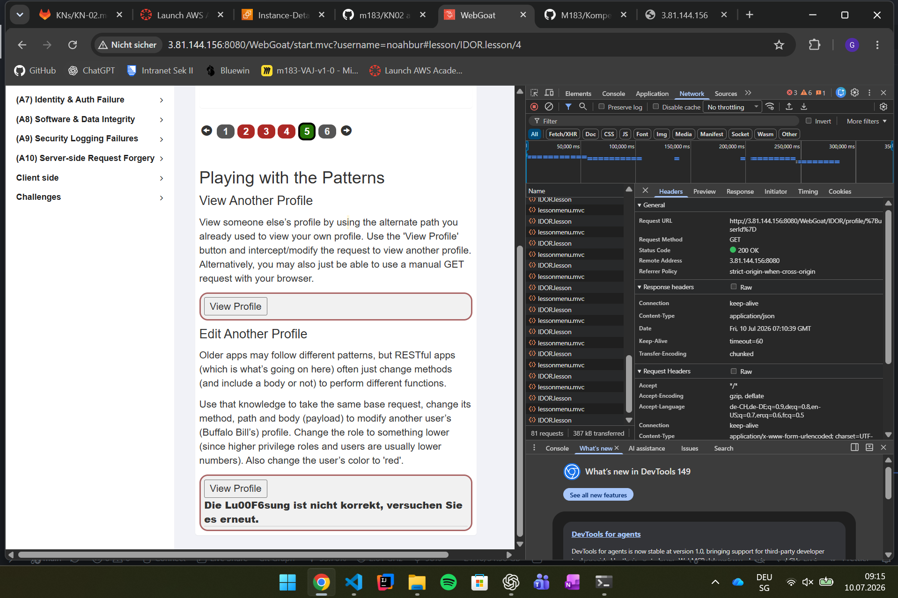

Über die Funktion **View Profile** wurde zunächst das eigene Profil aufgerufen. Anschliessend wurde die Benutzer-ID im Request verändert, wodurch das Profil eines anderen Benutzers angezeigt werden konnte.

Dies zeigt, dass die Anwendung lediglich der übermittelten Objekt-ID vertraute und keine ausreichende Berechtigungsprüfung durchführte.

---

# E2) Fremdes Profil verändern

## Erfolgreiche Manipulation

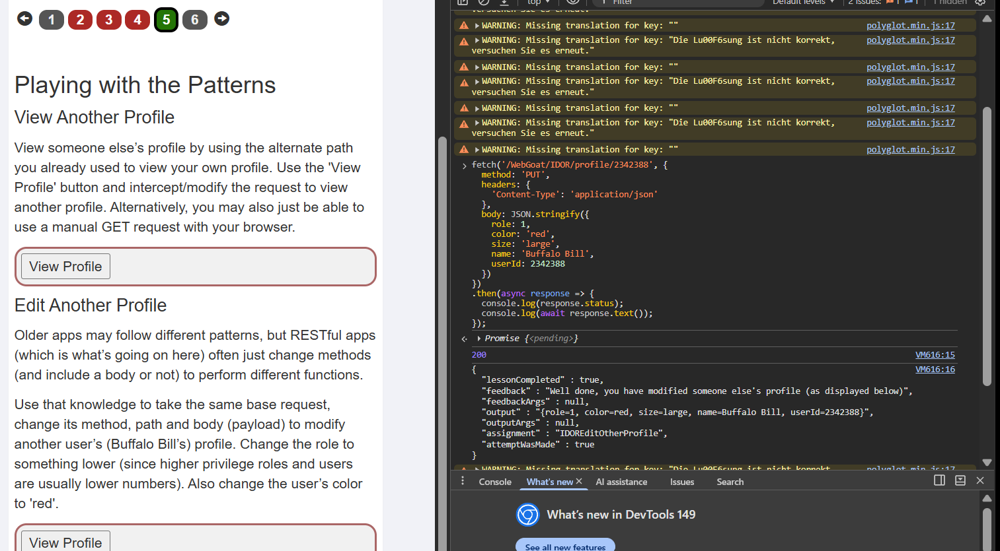

Nachdem das fremde Profil identifiziert wurde, wurde derselbe Endpunkt mit der HTTP-Methode **PUT** verwendet.

Dabei wurden unter anderem die Rolle des Benutzers sowie dessen Farbe geändert.

Dadurch konnte nachgewiesen werden, dass die Anwendung nicht nur unberechtigten Lesezugriff, sondern ebenfalls unberechtigte Änderungen zulässt.

---

# Schriftliche Antworten

## Warum reicht es nicht, eine Ressource einfach «nicht zu verlinken», um sie zu schützen? (Security through Obscurity)

Das Verstecken einer Ressource oder das Weglassen eines Links bietet keinen echten Schutz. Ein Angreifer kann die URL oder die Objekt-ID trotzdem erraten oder durch das Verändern von Requests finden. Sicherheit darf deshalb nicht auf «Security through Obscurity» beruhen, sondern muss durch serverseitige Zugriffsprüfungen gewährleistet werden.

---

## Wie hätte die Applikation den IDOR-Angriff verhindern können?

Der Server muss bei jeder Anfrage überprüfen, ob der angemeldete Benutzer tatsächlich berechtigt ist, auf die angeforderte Ressource zuzugreifen oder diese zu verändern. Dabei darf nicht ausschliesslich die übermittelte ID verwendet werden. Gehört die Ressource nicht dem angemeldeten Benutzer und besitzt dieser keine entsprechenden Rechte, muss der Server den Zugriff verweigern (z. B. HTTP 403 Forbidden).

---

## Was ist der Unterschied zwischen horizontaler und vertikaler Privilegienerweiterung? Welche Form zeigt dieses IDOR-Beispiel?

**Horizontale Privilegienerweiterung:** Ein Benutzer greift auf Daten oder Funktionen eines anderen Benutzers mit derselben Berechtigungsstufe zu.

**Vertikale Privilegienerweiterung:** Ein Benutzer verschafft sich höhere Berechtigungen, beispielsweise Administratorrechte.

Dieses IDOR-Beispiel zeigt eine **horizontale Privilegienerweiterung**, da ein normaler Benutzer auf das Profil eines anderen normalen Benutzers zugreifen beziehungsweise dieses verändern kann.

---

## Welche OWASP Top 10 Kategorie (2025) beschreibt Broken Access Control?

**A01:2025 – Broken Access Control**

Broken Access Control steht auf Platz 1 der OWASP Top 10, weil fehlerhafte Zugriffsprüfungen zu den häufigsten und kritischsten Sicherheitslücken in Webanwendungen gehören. Sie ermöglichen unbefugten Zugriff auf Daten oder Funktionen und können zu Datenverlust, Manipulation oder einer vollständigen Kompromittierung einer Anwendung führen.

---

# Fazit E

Die IDOR-Übung zeigte, dass das Vertrauen in vom Client übermittelte Objekt-IDs ein erhebliches Sicherheitsrisiko darstellt. Ohne konsequente serverseitige Autorisierungsprüfungen können Angreifer auf fremde Ressourcen zugreifen oder diese verändern. Jede Anfrage muss deshalb serverseitig validiert werden, unabhängig davon, ob eine Ressource in der Benutzeroberfläche sichtbar oder verlinkt ist.