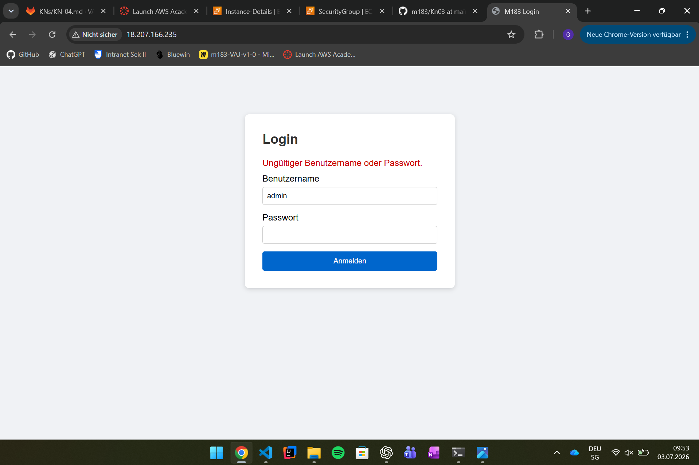
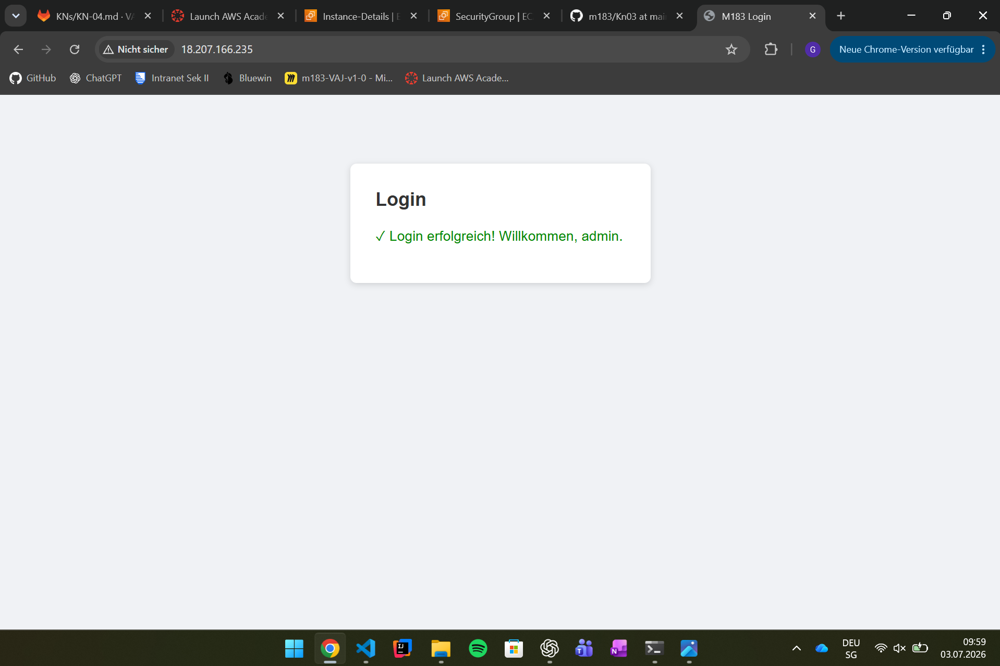
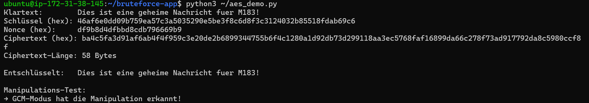
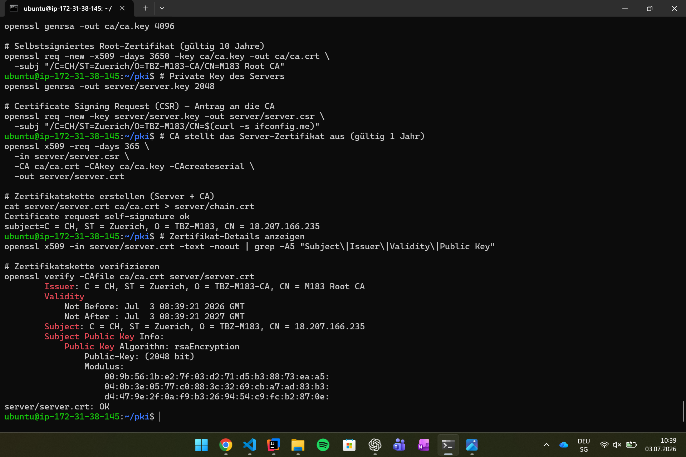
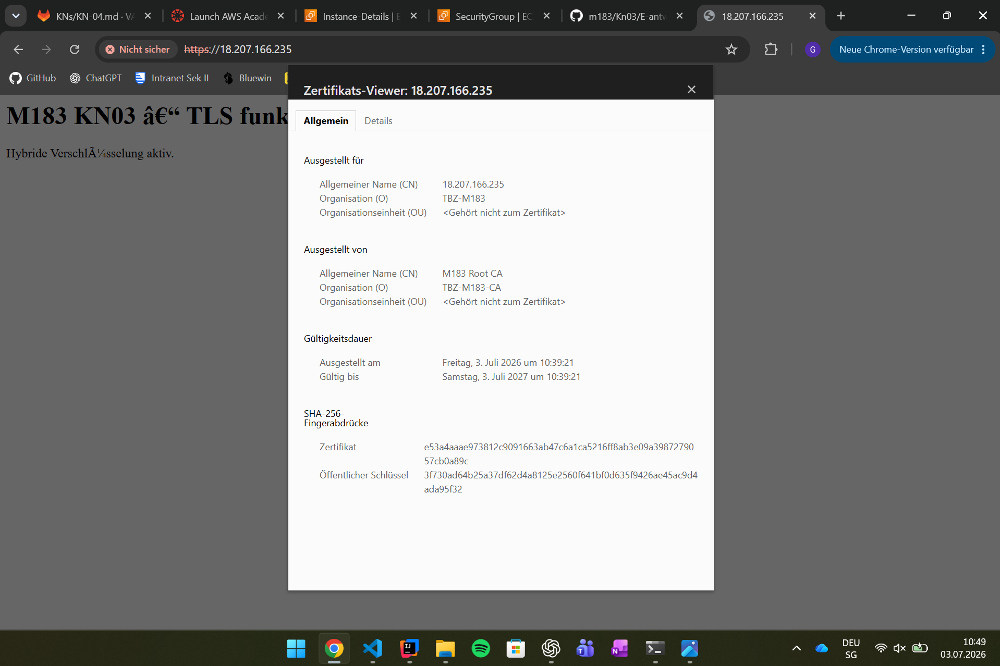
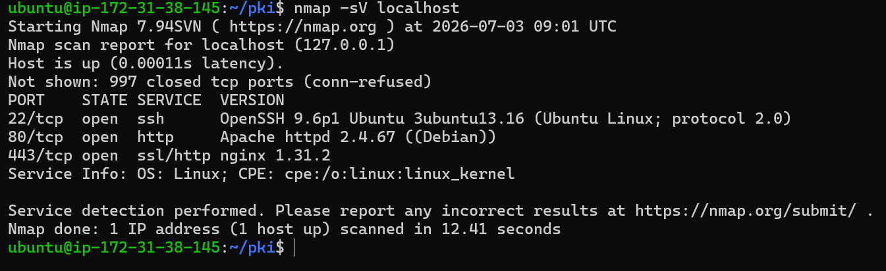
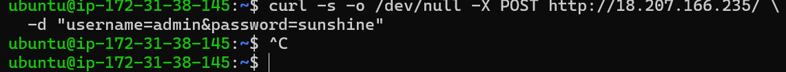
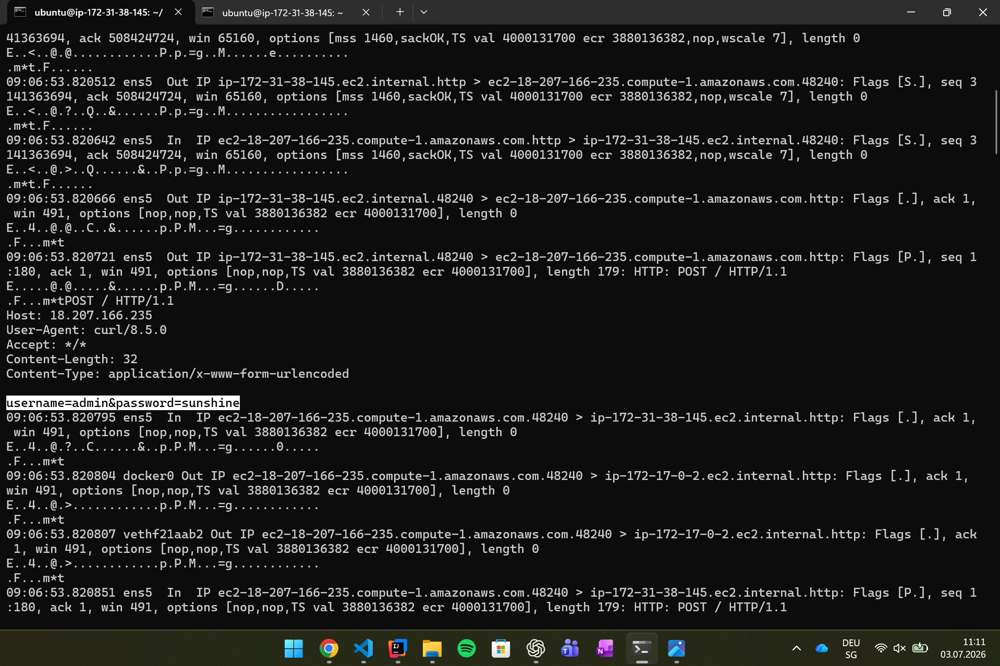
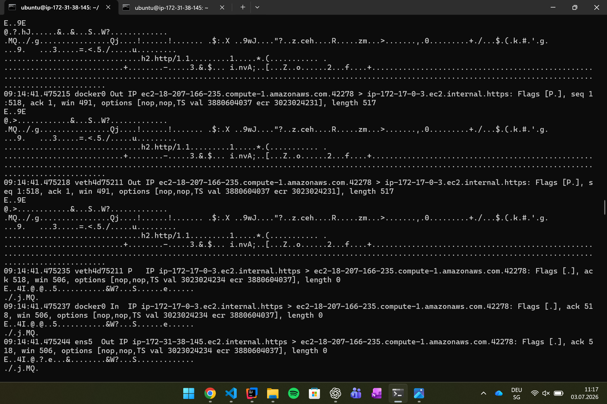
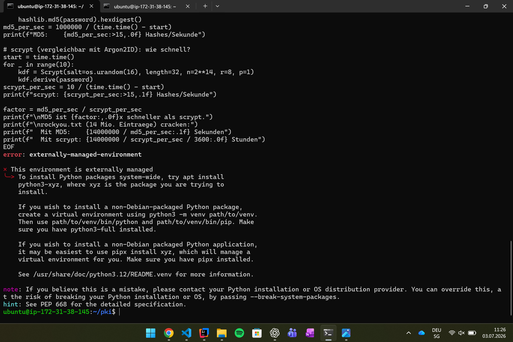

# KN-04 – Verschlüsselung & Kryptographie (M183)

## Übersicht

In diesem Kompetenznachweis wurden verschiedene Verfahren und Konzepte der modernen Kryptographie praktisch umgesetzt. Dazu gehörten ein Brute-Force-Angriff auf eine Webanwendung, AES-256-Verschlüsselung, der Aufbau einer eigenen PKI, HTTPS mit TLS, die Analyse von HTTP/HTTPS-Traffic sowie das Knacken von MD5-Hashes.

---

# A) Brute-Force-Angriff auf ein Web-Login

## Login-Seite



Die Loginseite wurde erfolgreich auf der EC2-Instanz bereitgestellt.

---

## Erfolgreicher Login



Nach dem Brute-Force-Angriff konnte das gefundene Passwort erfolgreich verwendet werden.

---

## Brute-Force-Ausgabe


### Schriftliche Antworten

#### Wie viele Versuche und wie viele Sekunden hat der Angriff benötigt?

Der Angriff benötigte **13 Versuche** und **0.08 Sekunden**, um das Passwort **sunshine** zu finden.

Würde statt einer Liste mit 20 Passwörtern eine Wortliste mit **1 Million Einträgen** verwendet, würde der Angriff deutlich länger dauern. Ohne Schutzmechanismen könnten trotzdem sehr viele Passwörter automatisch ausprobiert werden.

#### Welche zwei technischen Massnahmen hätten den Angriff verhindert oder erschwert?

- Rate-Limiting (Verzögerung nach mehreren Fehlversuchen)
- Account-Lockout bzw. Kontosperrung nach mehreren Fehlversuchen

#### Warum ist das Passwort *sunshine* schwach?

Es handelt sich um ein häufig verwendetes Wörterbuchwort. Solche Passwörter befinden sich bereits in bekannten Passwortlisten und werden deshalb bei Wörterbuchangriffen sehr schnell gefunden.

---

# B) AES-256-GCM

## Konsolenausgabe



### Schriftliche Antworten

#### Was ist ein Nonce?

Ein Nonce ist eine einmalige Zufallszahl, welche bei jeder Verschlüsselung neu erzeugt werden muss. Dadurch wird verhindert, dass gleiche Nachrichten mit demselben Schlüssel identische Ciphertexte erzeugen.

#### Unterschied DES und AES-256 bezüglich Brute Force

DES besitzt lediglich einen **56-Bit-Schlüssel** und kann heute mit moderner Hardware durch Brute Force geknackt werden.

AES-256 verwendet einen **256-Bit-Schlüssel**, wodurch ein vollständiger Brute-Force-Angriff praktisch unmöglich ist.

#### Was zeigt der Manipulationstest?

Nach einer Veränderung des Ciphertexts erkennt AES-GCM die Manipulation sofort und verweigert die Entschlüsselung.

Der Vorteil gegenüber AES-CBC besteht darin, dass GCM neben der Vertraulichkeit zusätzlich auch die Integrität der Daten schützt.

---

# C) PKI mit OpenSSL

## OpenSSL-Ausgabe



### Schriftliche Antworten

#### Unterschied selbstsigniertes und CA-signiertes Zertifikat

Ein selbstsigniertes Zertifikat wird vom Besitzer selbst erstellt und signiert.

Ein CA-signiertes Zertifikat wird von einer vertrauenswürdigen Certificate Authority signiert und deshalb von Browsern akzeptiert.

#### Was enthält ein CSR?

Ein CSR enthält:

- öffentlichen Schlüssel
- Common Name
- Organisation
- Land

Er dient dazu, einer CA alle notwendigen Informationen zum Erstellen eines Zertifikats bereitzustellen.

#### Warum vertraut der Browser dem Zertifikat nicht?

Die selbst erstellte Root-CA befindet sich nicht im Vertrauensspeicher des Browsers. Deshalb erscheint trotz technisch korrektem Zertifikat eine Sicherheitswarnung.

---

# D) HTTPS / TLS

## Zertifikatsdialog



### Schriftliche Antworten

#### Welche Informationen zeigt der Browser?

Der Browser zeigt:

- Common Name (CN)
- Organisation
- Aussteller
- Gültigkeitsdauer
- Fingerprint
- Öffentlichen Schlüssel

Selbst definiert wurden der Common Name, die Organisation, der Aussteller (Root CA) sowie die Gültigkeitsdauer.

#### Warum erscheint eine Sicherheitswarnung?

Die Root-CA wurde selbst erstellt und ist dem Browser nicht bekannt. Deshalb kann die Echtheit des Zertifikats nicht automatisch bestätigt werden.

#### Wie funktioniert hybride Verschlüsselung?

Beim TLS-Handshake wird mithilfe asymmetrischer Kryptographie ein gemeinsamer Sitzungsschlüssel sicher ausgetauscht.

Anschliessend erfolgt die eigentliche Datenübertragung mit einer schnellen symmetrischen Verschlüsselung (AES).

---

# E) HTTP vs. HTTPS

## Nmap-Scan



### Frage

#### Was zeigt nmap?

Der Scan zeigt:

- Port 80 → Apache HTTP Server
- Port 443 → nginx HTTPS
- Port 22 → OpenSSH

Ein Angreifer erkennt bereits offene Ports, eingesetzte Softwareversionen sowie das Betriebssystem und kann dadurch gezielt nach bekannten Sicherheitslücken suchen.

---

## HTTP-Request mit curl



Der Login-Request wird per HTTP an den Webserver gesendet.

---

## HTTP mit tcpdump



### Fragen

#### Was ist sichtbar?

Der komplette HTTP-Request inklusive Header und Formulardaten ist lesbar.

Das Passwort befindet sich in folgender Zeile:

```text
username=admin&password=sunshine
```

#### Was müsste ein Angreifer tun?

Ein Angreifer müsste sich mittels **ARP-Spoofing** bzw. eines **Man-in-the-Middle-Angriffs** zwischen Client und Server schalten und den Netzwerkverkehr mitschneiden.

---

## HTTPS mit tcpdump



### Fragen

#### Unterschied zwischen HTTP und HTTPS

Bei HTTP sind sämtliche Daten inklusive Benutzername und Passwort im Klartext sichtbar.

Bei HTTPS sind lediglich TLS-Handshake-Daten sowie verschlüsselte Bytes sichtbar.

#### Was passiert beim TLS-Handshake?

Während des Handshakes wird das Zertifikat überprüft und mittels asymmetrischer Kryptographie ein gemeinsamer Sitzungsschlüssel vereinbart.

Danach erfolgt die Datenübertragung mit symmetrischer AES-Verschlüsselung.

#### Warum bleiben IP-Adressen sichtbar?

IP-Adressen werden für das Routing im Netzwerk benötigt und können deshalb nicht verschlüsselt werden.

Verschlüsselt wird ausschliesslich der Inhalt der Verbindung.

# F) MD5-Hashes

## Ausgabe



### Schriftliche Antworten

#### Welche Passwörter wurden geknackt?

Gefunden wurden:

- alice → sunshine
- bob → dragon
- carol → iloveyou
- dave → letmein

Nicht gefunden wurden:

- eve
- frank

Die gefundenen Passwörter befinden sich in der Wortliste.

Franks Passwort **correcthorsebatterystaple** ist deutlich länger und nicht Bestandteil der verwendeten Passwortliste.

#### Wie lange würde rockyou.txt dauern?

Mit ungefähr **162'886 Hashes pro Sekunde** würde eine Wortliste mit **14 Millionen Passwörtern** ungefähr

**14'000'000 / 162'886 ≈ 86 Sekunden**

benötigen.

#### Welche zwei Massnahmen machen gestohlene Hashes unbrauchbar?

- Salt
- Langsame Passwort-Hashverfahren wie Argon2ID oder scrypt

Dadurch werden Wörterbuch- und Rainbow-Table-Angriffe massiv erschwert.

---

# Fazit

Während dieses Kompetenznachweises wurden verschiedene Verfahren der Kryptographie praktisch umgesetzt.

Dabei wurde gezeigt:

- wie einfach schwache Passwörter per Brute Force gefunden werden,
- weshalb AES-256-GCM einen hohen Schutz gegen Manipulation bietet,
- wie eine PKI mit OpenSSL aufgebaut wird,
- wie HTTPS durch TLS funktioniert,
- weshalb HTTP unsicher ist,
- weshalb MD5 heute nicht mehr zur Passwortspeicherung verwendet werden sollte.

Die Übungen verdeutlichen den praktischen Nutzen moderner Sicherheitsmechanismen im täglichen Einsatz.