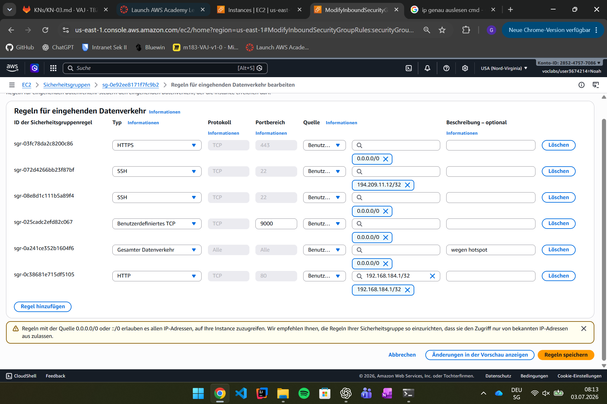
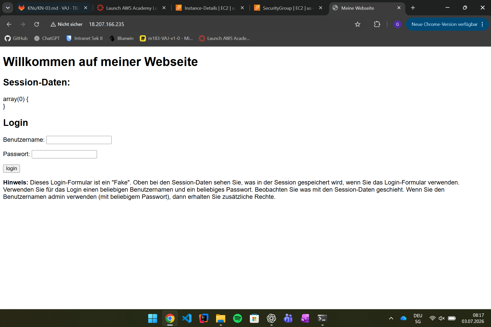
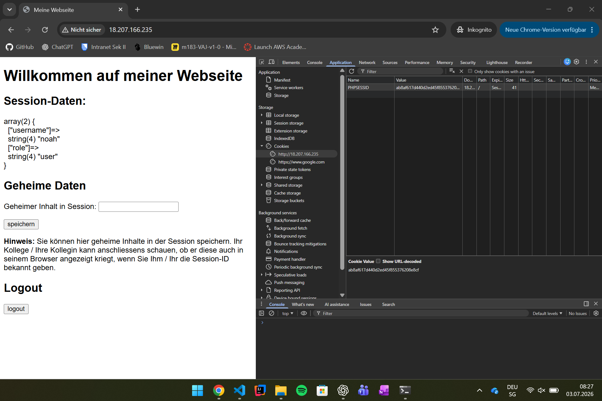
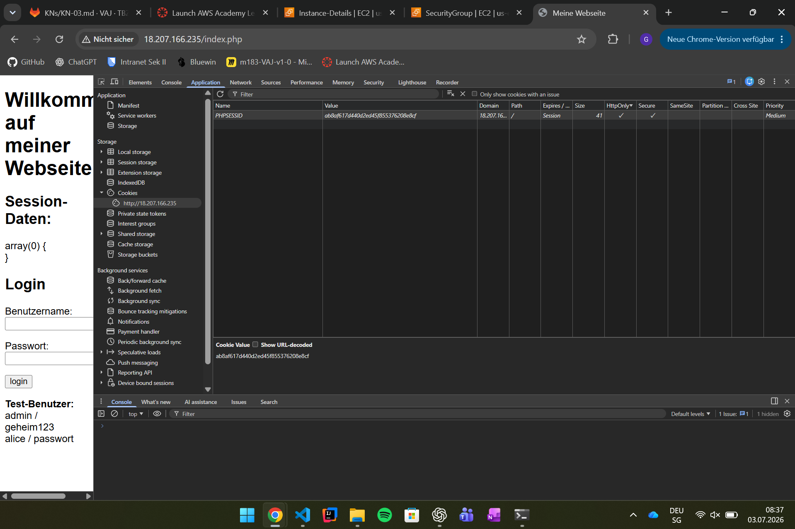

# KN03 – Sessionhandling & Authentifizierung absichern

## Lernziele
- Sicherheitslücken im Sessionhandling erkennen
- Session Fixation verstehen und beheben
- Passwörter mit Argon2ID hashen
- Session-Cookies absichern
- MFA-Faktoren erklären

---

# Aufgabe A – App deployen

## Screenshot Sicherheitsgruppe

## Screenshot Website

---

# Aufgabe B – Sicherheitslücken analysieren

## Identifizierte Sicherheitslücken

1. Passwort wird nicht geprüft (OWASP A07)
2. Admin-Rechte nur über den Benutzernamen (OWASP A01)
3. Session-ID wird nach Login nicht erneuert (Session Fixation)
4. Session-Daten werden mit `var_dump($_SESSION)` angezeigt
5. Kein CSRF-Schutz

## Schriftliche Antworten
Siehe **B-.md**.

---

# Aufgabe C – Session Fixation

## Screenshot

## Videos

- `C-pw_falsch.mp4`
- `C-pw_richtig.MOV`

## Antworten

- Beide Browser verwendeten dieselbe Session-ID.
- Dadurch war der zweite Browser automatisch angemeldet.
- Das ist gefährlich, weil ein Angreifer eine bekannte Session übernehmen kann.
- Schutz: `session_regenerate_id(true)`.

Weitere Details siehe **C-antwort.md**.

---

# Aufgabe D – Sicherheitslücken beheben

## Screenshot Cookie-Flags

## Umgesetzte Fixes

- Session-ID nach Login erneuert
- Passwortprüfung mit Argon2ID
- Cookie-Flags:
  - HttpOnly
  - Secure
  - SameSite=Strict

## Antworten

- HttpOnly schützt vor XSS-bedingtem Cookie-Diebstahl.
- SameSite=Strict schützt vor CSRF.
- Argon2ID ist für Passwörter geeignet, MD5/SHA-1 nicht.

Weitere Details siehe **D-antwort.md**.

---

# Aufgabe E – MFA

## Tabelle

| Kategorie | Beschreibung | Beispiel 1 | Beispiel 2 |
|-----------|--------------|------------|------------|
| Wissen | Etwas das Sie wissen | Passwort | PIN |
| Besitz | Etwas das Sie besitzen | Smartphone | YubiKey |
| Inhärenz | Etwas das Sie sind | Fingerabdruck | Gesichtserkennung |
| Ort | Wo Sie sich befinden | Firmennetz | GPS-Standort |

## Antworten

- Passwort + PIN → kein MFA (beides Wissen)
- Passwort + SMS → echtes MFA (Wissen + Besitz)
- AWS STS → temporäre Tokens, ähnelt dem Faktor Besitz.

Weitere Details siehe **E-antwort.md**.

---

# Verwendete Technologien

- PHP 8.2
- Apache
- Docker
- AWS EC2
- Google Chrome DevTools

---
